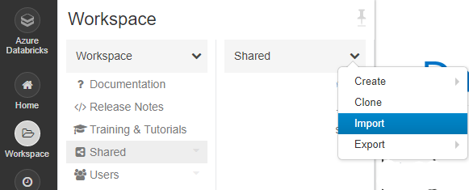
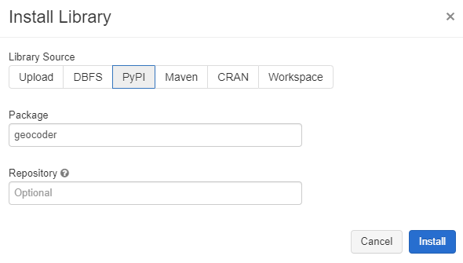
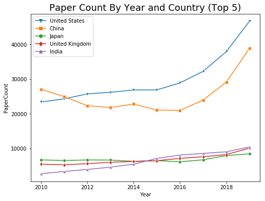

# Topic Paper Growth by Country Sample (PySpark)

In this sample, you draw paper growth comparison figure of various countries using Microsoft Academic Graph (MAG) on Azure Databricks.

## Prerequisites

Complete these tasks before you begin this tutorial:

* Setting up provisioning of Microsoft Academic Graph to an Azure blob storage account. See [Get Microsoft Academic Graph on Azure storage](https://docs.microsoft.com/academic-services/graph/get-started-setup-provisioning).

* Setting up Azure Databricks service. See [Set up Azure Databricks](https://docs.microsoft.com/academic-services/graph/get-started-setup-databricks).

* Setting up Bing Maps API Key. See [Create a Bing Maps Key](https://www.microsoft.com/maps/create-a-bing-maps-key). Before using this API, review the [Bing Maps API Rate Limit](https://docs.microsoft.com/bingmaps/getting-started/bing-maps-api-best-practices#rate-limiting). It will consume about 12,000 transactions if we choose "artificial intelligence" as target topic.

## Gather the information that you need

   Before you begin, you should have these items of information:

   :heavy_check_mark:  The name of your Azure Storage (AS) account containing MAG dataset from [Get Microsoft Academic Graph on Azure storage](https://docs.microsoft.com/academic-services/graph/get-started-setup-provisioning.md#note-azure-storage-account-name-and-primary-key).

   :heavy_check_mark:  The access key of your Azure Storage (AS) account from [Get Microsoft Academic Graph on Azure storage](https://docs.microsoft.com/academic-services/graph/get-started-setup-provisioning.md#note-azure-storage-account-name-and-primary-key).

   :heavy_check_mark:  The name of the container in your Azure Storage (AS) account containing MAG dataset.

   :heavy_check_mark:  The API key from Bing Maps.

## Import PySparkMagClass shared notebook

In this section, you import PySparkMagClass.py as a shared notebook in Azure Databricks workspace. You will run this utility notebook from another notebook later.

1. Save **`samples/PySparkMagClass.py`** in MAG dataset to local drive.

1. In the [Azure portal](https://portal.azure.com), go to the Azure Databricks service that you created, and select **Launch Workspace**.

1. On the left, select **Workspace**. From the **Workspace** > **Shared** drop-down, select **Import**.

    
    
1. Drag and drop PySparkMagClass.py to the **Import Notebook** dialog box.

    

1. Select **Import**. This will create a notebook with path `"/Shared/PySparkMagClass"`. No need to run this notebook.

   > [!NOTE]
   > When importing this notebook under **Shared** folder. The full path of this notebook is `"/Shared/PySparkMagClass"`. If you import it under other folders, note the actual full path and use it in following sections.

## Setup Databricks environment variable and library
In this section, you import Bing Maps API as a environment variable and setup [Geocoder](https://geocoder.readthedocs.io/index.html) as a cluster's library in Azure Databricks workspace.

1. In Azure Databricks workspace portal, from **Clusters** > **Interactive Clusters**, click the cluster you created.

1. Click **Edit**.

1. Under **Advanced Options** > **Spark**, add a new line with Bing Maps API Key: 
**BING_API_KEY=(your_api_key)** and click **Confirm**.

1. Click **Start** (Cluster must be running to instell packages).

1. Under **Libraries**, click **Install New**.

1. On the popup, click **PyPI**, input `geocoder`, and click **Install**.

    

## Run TopicPaperGrowthByCountry sample notebook

In this section, you import TopicPaperGrowthByCountry.py as a notebook in Azure Databricks workspace and run the notebook.

1. Save **`samples/TopicPaperGrowthByCountry.py`** in MAG dataset to local drive.

1. In Azure Databricks workspace portal, from the **Workspace** > **Users** > **Your folder** drop-down, select **Import**.

1. Drag and drop TopicPaperGrowthByCountry.py to the **Import Notebook** dialog box.

1. Replace `<AzureStorageAccount>`, `<AzureStorageAccessKey>`, and `<MagContainer>` placeholder values with the values that you collected while completing the prerequisites of this sample.

   |Value  |Description  |
   |---------|---------|
   |**`<AzureStorageAccount>`** | The name of your Azure Storage account. |
   |**`<AzureStorageAccessKey>`** | The access key of your Azure Storage account. |
   |**`<MagContainer>`** | The container name in Azure Storage account containing MAG dataset, usually in the form of **mag-yyyy-mm-dd**. |

1. Click **Run All** button. It could take about 20-30 minutes to run on standard cluster. 

1. You see an output similar to the following snippet:

    

## Clean up resources

After you finish the tutorial, you can terminate the cluster. From the Azure Databricks workspace, select **Clusters** on the left. For the cluster to terminate, under **Actions**, point to the ellipsis (...) and select the **Terminate** icon.

If you don't manually terminate the cluster, it automatically stops, provided you selected the **Terminate after \_\_ minutes of inactivity** check box when you created the cluster. In such a case, the cluster automatically stops if it's been inactive for the specified time.

## Resources

* [Create an Azure Databricks service](https://azure.microsoft.com/services/databricks/)
* [Create a cluster for the Azure Databricks service](https://docs.azuredatabricks.net/user-guide/clusters/create.html)
* [Import this notebook and attach it to the cluster](https://docs.databricks.com/user-guide/notebooks/notebook-manage.html#import-a-notebook)
